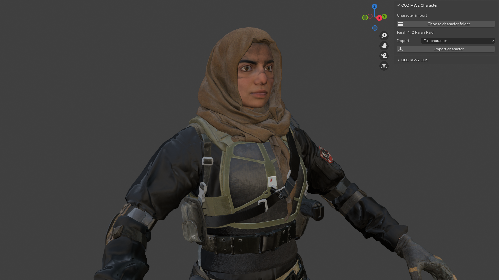
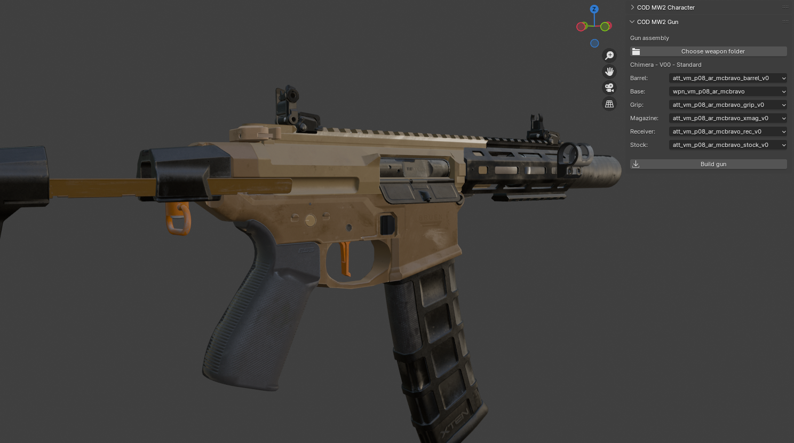
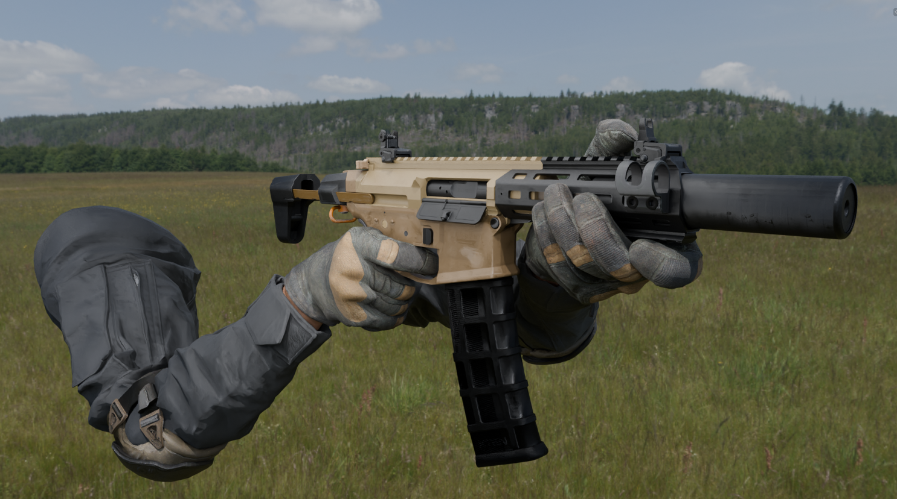

# Call of Duty Blender Tools

### Blender scripts for importing and assembling Call of Duty guns and characters, with automatic material and texture assignment.

## Features

- Import gun parts from `.semodel` files
- Assemble weapons from separate components
- Preserve armatures, weights and attachment bones
- Import character body and head into one rig
- Import first-person arms separately
- Automatically load materials and DDS textures

## Screenshots

## Requirements

- Blender 4.0
- `io_model_semodel` Blender add-on

## Installation

1. Install Blender 4.0.
2. Install and enable the `io_model_semodel` add-on.
3. Download this repository.
4. Open a script in Blender's **Scripting** workspace.
5. Click **Run Script**.

## Usage

Open the 3D View sidebar with `N`.

The tools are available in the **COD** tab:

- **COD MW2 Gun** — import and assemble weapon parts.
- **COD MW2 Character** — import characters or first-person arms.

Select the asset folder through the folder selection button. No paths need to be configured inside the scripts.

## Compatibility

The tools are designed for Call of Duty assets.

Currently tested with:

- Call of Duty: Modern Warfare II

Support for additional Call of Duty games may be added in the future.

## Notes

- The scripts are currently intended for Blender 4.0.
- Extracted game models and textures are not included.
- Use only legally obtained assets.
- This project is not affiliated with or endorsed by Activision or Infinity Ward.

## License

The scripts are provided for personal and educational use.
